# 1. Programs created to automate the creation of EtherCAT configuration files.

     
To use the following programs on Windows/Linux, Python 3.14 with tkinter is required. Then Open with …Phyton. 
***

<details>
<summary id="1-xml-generator">1. XML Generator</summary>

1.1 Load the .xml ESI file from the manufacturer.   


1.2 Replace the names of the HAL pins (PDO).    
It replaces the name modes of operation → opmode and a few others; all pin names can be found in the servodriver manual for example: fixed pdo mapping chapter, 6000 group object dictionary. 


1.3 Reduce PDOs to CSP essential.   
Keeps the first output group and the first input PDO, keeps essential PDOs for CSP mode; if you want to use CSV mode, target velocity is kept instead of target position. The text can be edited manually. 


1.4 Duplicate the slave.   
Each click duplicates the text </slave... </slave> and increments the slave index in numerical order. 


1.5 Save Xml                              


</details>

---

<details>
<summary id="2-hal-generator">2. HAL Generator</summary>

2.1 Load ethercat-conf.xml   
After loading ethercat-conf.xml, all PDOs available in the selected file will appear, and in the HAL generation window on the right side, the configuration initialization section will appear.
LinuxCNC executes the configuration line by line, initializing modules, setting parameters, and preparing the system for motion control.
Among others, in this line: "loadusr -W lcec_conf ethercat-conf.xml", the PDOs from the file with the prefix lcec will be loaded into the HAL module running in LinuxCNC’s internal memory in real time, where all signal connections between devices and the control system are created. 


2.2. load cia402.comp   
The .comp file is parsed into pins and parameters; most of the suggested pins are automatically matched. The pos_scale value should be selected based on the encoder and the stroke per revolution


2.3. Axis selection    
During selection, a specific machine axis (X, Y, Y2, Z, etc.) is assigned to the selected EtherCAT slave, and parameters common to all axes are set. Based on this, the program automatically connects the selected axis to the appropriate control input. 
The HAL file preview is updated in real time, making it easy to understand which value is responsible for what and how the individual settings are related to each other while changing parameters. 


2.4.Save HAL   


</details>

---

<details>
<summary id="3-ini-generator">3. INI Generator</summary>

3.1 Load HAL   
The HAL file is treated here as a description of logical connections. In LinuxCNC, an abstract logical model is created that corresponds to how LinuxCNC sees the machine.
Here it is similar, except that the file is only analyzed. The program checks whether the servos share common signals and whether the set of signals is consistent.
The machine moves within a closed space, and homing in this configuration is intended for absolute encoders, which most often use soft limits [MIN_LIMIT] [MAX_LIMIT] often without the use of physical limit switch inputs and I/O modules. For this reason, before using automatic configuration, proper installation of the CIA402 homing component is required.
(linuxcnc-dev, cia402_homecomp.comp, cia402_homecomp.h, basecomp.comp) 


3.2.Gantry mode   
In other words, using two motors in one plane.
After switching to gantry mode, the following arrangement is created:        
`1 : 1                                      Gantry    `       
`Axis X → joint.0                           Axis X → joint.0    `      
`Axis Y → joint.1                           Axis Y → joint.1 , joint.2    `  
`Axis Z → joint.2                           Axis Z →  joint.3    `      
`Axis A → joint.3    `   
And the parameters in [KINS] and [TRAJ] change dynamically and later define the recognition of the mode by LinuxCNC during loading.   


3.3.Save INI   


</details>

---

<details>
<summary id="4-dosstyle--utf-8-lf-converter">4. DosStyle → UTF-8 LF Converter</summary>

4.1 When files are saved in the programs presented above on Windows, DosStyle line endings are created. It is enough to enable the Converter, enter the given folder with the files, or load the files individually, or paste the file path, and press convert. 


</details>

---

<details>
<summary id="5-ethercat-solutions">5. Some EtherCAT Solutions</summary>

5.1 Operating State  
The master must be active before the slaves, because in EtherCAT the master performs the role of synchronization and managing the communication cycle. The slaves cannot initiate transmission or synchronize with the bus on their own; they wait until the master starts the data cycle and distributes the timing. If the master is not active, the slaves will be in a waiting or error state, because they will not receive the reference clock or control commands. In many cases, re-initialization will not occur. Therefore, powering on the slaves or connecting the cable with already powered slaves should properly happen after starting the LinuxCNC GUI.


  
5.2 Some Error during LinuxCNC startup               
rtapi_shmem_new failed due to shmget(key=0xacb572c7): Invalid argument    
lcec_conf: ERROR: couldn't allocate user/RT shared memory   
  
check shared memory: ipcs -m         
Fild locket segment and delate: sudo ipcrm -m 32812      

Example:  
k@k:~$ ipcs -m  
------ Shared Memory Segments --------    
key        shmid      owner      perms      bytes      nattch     status      
0x00000000 32775      k          600        4194304    2          dest         
0x00000000 10         k          600        524288     2          dest         
0x00000000 15         k          600        524288     2          dest         
0x00000000 17         k          600        524288     2          dest         
0x00000000 19         k          600        4194304    2          dest         
0x00000000 32793      k          600        524288     2          dest         
0x00000000 28         k          600        1048576    2          dest         
0x00000000 360481     k          600        524288     2          dest         
0x00000000 294947     k          600        524288     2          dest         
0x00000000 262182     k          600        524288     2          dest         
0xacb572c7 32812      k          600        2644       0          locked      
0x00000000 55         k          600        524288     2          dest         
0x00000000 59         k          600        524288     2          dest         
0x00000000 62         k          600        524288     2          dest 

</details>


***


# 2. From LinuxCNC 2.9.8 Debian 13 Installation via EtherCat Master to the First Motor Movement    
        
      
 
<details>   
<summary id="1.-LinuxCNC-Installation">1. LinuxCNC Installation</summary>    
  
    
1.1 The installation applies to LinuxCNC 2.9.8 Debian 13 Trixie      
Download the image:        
https://www.linuxcnc.org/iso/linuxcnc_2.9.8-amd64.hybrid.iso     
Mount the ISO to a pendrive, e.g., using the Rufus program    
      
1.2 If Linux will be a second system, you can first create unallocated space on the disk in Windows:       
- Press Win + X and select Disk Management.    
- Shrink the partition (if you want to keep data)   
- In the Disk Management window, find the partition you want to shrink.    
- Right-click it and select Shrink Volume.      
- Enter by how many MB you want to shrink the partition     
– that much space will become unallocated.   
Click Shrink.     
         
1.3 Change the boot order in BIOS to set the pendrive as first.    
After booting from the pendrive, select install LinuxCNC   
Manual disk selection     
Partition selection: one EFI system partition is required, a swap partition 4–16 GB, and an ext4 partition with the mount point /     
Use as: EFI system partition     
Use as: swap partition 4–16 GB       
Use as: ext4 partition with mount point /     
*If you have a Legacy BIOS, the system installs using the disk's MBR, and no EFI partition is created
*If the EFI partition already exists, select use as system partition and do not format.   
*The EFI partition must contain a Debian entry for the system to boot from the disk    
     
1.4 If GRUB does not want to install, choose Finish without a bootloader   
However, in this situation, leave the pendrive so that Linux can boot again.   
And select at the top: Live LinuxCNC   
To install GRUB via the Internet   
     
1.5 In Live Linux    
connect to the Internet via the toolbar.    
     
      
     
Then open the terminal and enter the following commands in order to enable downloading via the Internet:    
    
```sudo cp /etc/resolv.conf /mnt/etc/resolv.conf```    
```sudo mount --bind /etc/resolv.conf /mnt/etc/resolv.conf```    
Check the Internet:    
```ping -c 3 deb.debian.org```    
    
1.6 Mounting and operating on system partitions to add an entry to EFI    
Check the partitions:     
lsblk -f    

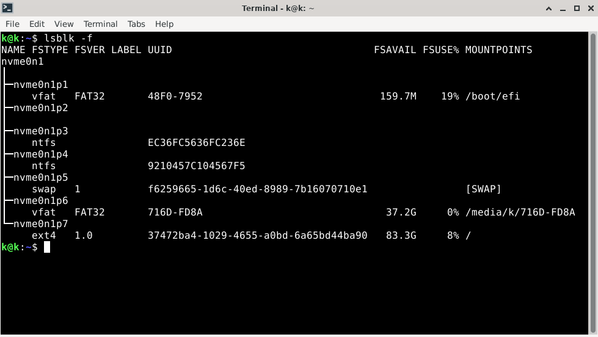        
   
Mount the EFI partition and the /ext4 partition by their names, in this case:    
```sudo mount /dev/nvme0n1p7 /mnt/```           Partition /EXT4     
```sudo mount /dev/nvme0n1p1 /mnt/boot/efi```   Partition  EFI      
        
Mount the system directories in order:    
```sudo mount --bind /dev  /mnt/dev```    
```sudo mount --bind /proc /mnt/proc```    
```sudo mount --bind /sys  /mnt/sys```    
```sudo mount --bind /run  /mnt/run```    
    
Now GRUB installation:    
Enter Debian (ch root)      
```sudo chroot /mnt```     
The prompt should appear as: root@debian:/#     
     
Install GRUB       
```apt update```      
```apt install grub-efi-amd64 efibootmgr```       
      
Install GRUB to EFI:     
```grub-install --target=x86_64-efi --efi-directory=/boot/efi --bootloader-id=Debian```     
     
Optional, Generate the menu    
```update-grub``` 
         
Exit and clean up   
```exit```    
```sudo umount -R /mnt```  
      
```reboot```    
     
Now the entry in EFI (/boot/efi/EFI/Debian/) has already been created, Linux will boot normally.     
End of installation – remove the pendrive; at startup, you can access the boot manager by pressing, e.g., F7, depending on the BIOS.     

*If it's a Legacy BIOS, the commands are as follows:    
Mount the / partition (EXT4) by its device name, in this case:     
```sudo mount /dev/nvme0n1p7 /mnt```      

Bind the system directories one by one:    
```sudo mount --bind /dev  /mnt/dev```    
```sudo mount --bind /proc /mnt/proc```     
```sudo mount --bind /sys  /mnt/sys```     
```sudo mount --bind /run  /mnt/run```      
    
Enter Debian (ch root)      
```sudo chroot /mnt```      
    
Install GRUB to the MBR of the entire disk (replace nvme0n1 with your disk's device name):         
```apt update && apt install -y grub-pc && grub-install /dev/nvme0n1 && update-grub```       
      
      
Optionally, regenerate the GRUB menu:              
```update-grub```    
Exit and clean up                       
```exit```    
```sudo umount -R /mnt```     
```reboot```     
     
</details>    

</details>    

---
       
<details>     
<summary id="2.-Preparing-the-System-for-EtherCAT">2. Preparing the System for EtherCAT</summary>    
     
2.1 Start the system     
2.2 Network card configuration     
Click on the network settings in the top right corner.     
Change the first 2 tabs, disable the rest    
     
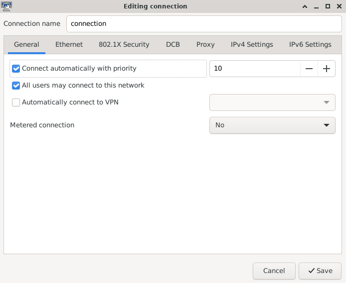  
    
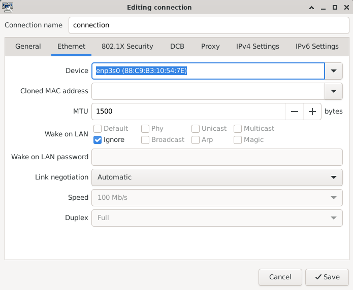 
     
2.3 Disable NETWORKMANAGER for the network card so that EtherCAT has exclusive access.     
Find the name of the card:            
```ip link```   
     
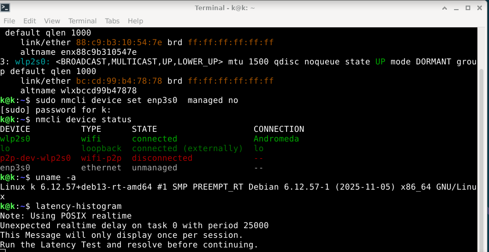     
    
Disable the Manager, replace enp3s0 with your own card name:     
```sudo nmcli device set enp3s0 managed no```    
Check if it has been unmenaged:       
```nmcli device status```     
          
2.4 System update         
```sudo apt update```     
```sudo apt upgrade```   
Continue? [Y/n] y    
               
2.5 Git installation       
```sudo apt update```     
```sudo apt install git```     
```git --version```    
         
</details>    

---

<details>      
<summary id="3.-EtherCAT-Master-Installation">3. EtherCAT Master Installation</summary>     
      
   Preparing the system for EtherCAT     
         
```sudo apt update```     
```sudo apt install  linuxcnc-ethercat```     
     
3.1 Check the MAC address of the network card     
```ip a```     
Then fill in     
 ```sudo geany /etc/ethercat.conf```     
      
 MASTER0_DEVICE="................"    
 DEVICE_MODULES="generic"     
   
And save and close.     
       
         
3.2 First EtherCAT startup, step by step:        
```sudo systemctl enable ethercat.service```        
```sudo systemctl start ethercat.service```       
```sudo systemctl status ethercat.service```       
```sudo chmod 666 /dev/EtherCAT0```       
      
3.3 Grant permission for EtherCAT Master at system startup         
```sudo geany /etc/udev/rules.d/99-ethercat.rules```          
Paste:        
```KERNEL=="EtherCAT[0-9]", MODE="0777"```         
Save and close.    
then type    
```sudo udevadm control --reload-rules```         
Restart the computer        
      
  
</details>  

---

<details>     
     
<summary id="4. Connecting servo drivers">4. Connecting servo drives</summary>           
       
At this stage, you can connect the EK1100 and the servo drivers to power, connect to the network card:    
Reset any errors on the servo drivers if they occur, according to the user manual.   
Then check:    
```sudo ethercat master```     
```sudo ethercat slaves```     
```uname -a```   
```latency-histogram```    
     
 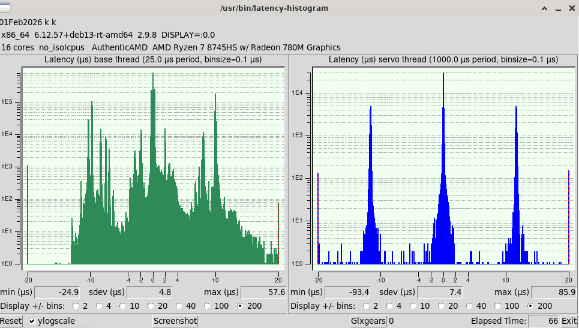     
        
After testing     
If the servo drivers are in the PREOP state, you can de-energize them:       
 ```sudo ethercat states INIT```      
 and turn off the power         
   
</details>  

---

<details>     
     
<summary id="5. Connecting network card to EtherCAT master">5. Connecting network card to EtherCAT master</summary>   
     
The network card can be connected to the EtherCAT master if it is recognized by it.      
Supported cards are mainly Intel with the igb  igc 1000 or 1000e driver.       
This ensures greater compatibility with real-time operations and allows the card to work exclusively under the control of EtherCAT.     
       
Checking the type of network card driver in the Kernel.        
```sudo apt update```       
```sudo apt install ethtool```       
Find the name of your card          
```ip a```      
     
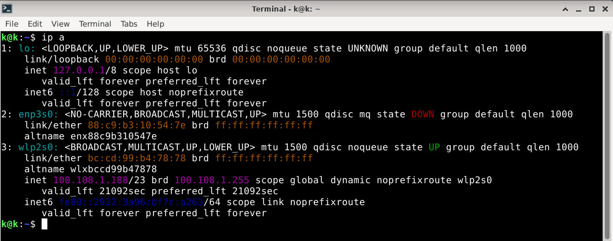   
        
and replace the name enp3s0 with your own         
```sudo ethtool -i enp3s0```         
Network card model     
```lspci -nn | grep -i ethernet```     
       
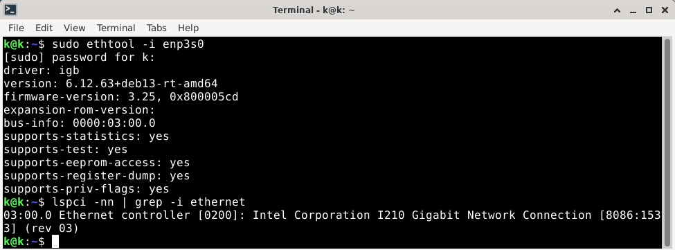          
        
If the network card driver is named igb, igc, 1000, 1000e, or any of the others listed in ethercat.conf, we will try to connect it to the master instead of using the generic mode.     
       
```sudo geany /etc/ethercat.conf```    
   
In this case, replace generic with:    
    
DEVICE_MODULES="igb"    
      
Save and close    
        
```sudo systemctl stop ethercat```     
```sudo systemctl start ethercat```    
     
We check whether the card is Native/attached   
     
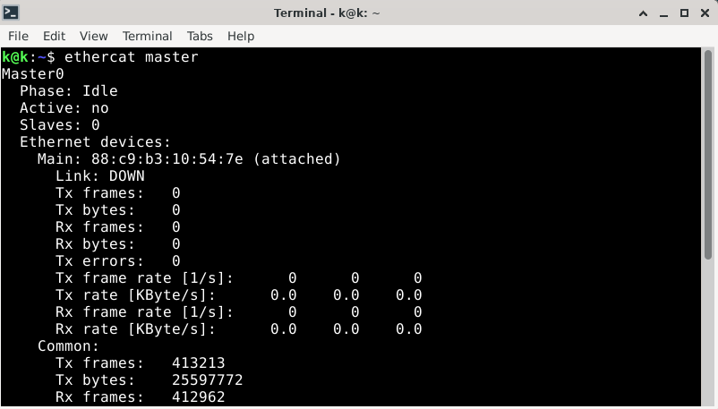         
     
If not, return to ethercat.conf and save generic again.     


 </details>

---

<details> 
   
            
<summary id="6.-Cia402.comp-Installation">6. Cia402.comp Installation</summary>     
        
```mkdir -p ~/dev```      
```cd ~/dev```     
```git clone https://github.com/dbraun1981/hal-cia402```        
```cd hal-cia402```      
```sudo halcompile --install cia402.comp``` 

</details>    

---
      
<details>        
      
<summary id="7.-Custom-Homing-Installation">7. Custom Homing Installation</summary>     
  
   
Install LinuxCNC source repositories      
```git clone https://github.com/LinuxCNC/linuxcnc.git linuxcnc-dev```        
    
then copy homecomp:   
```cd ~/dev```      
```git clone https://github.com/rodw-au/cia402_homecomp```      
     
5.1 Now you need to replace one line.     
Without terminal Browse through the folders and find this file:     
/home/..../linuxcnc-dev/src/emc/motion/homing.c And copy its exact path      
     
       
Then enter the folder /home/dev/cia402_homecomp,     
      
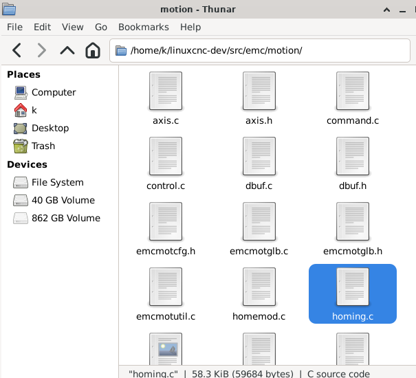    
     
Open the file cia402_homecomp.comp     
      
Find this line and replace it with your own path      
#define HOMING_BASE home/..../linuxcnc-dev/src/emc/motion/homing.c          
and save      
        
Open a new terminal and enter:     
```cd ~/dev/cia402_homecomp```     
       
```sudo halcompile --install cia402_homecomp.comp```     
     
At a later stage, make sure that such an entry exists in the INI file    
[EMCMOT]      
HOMEMOD = cia402_homecomp      
     
End    
At this stage, all necessary components have been installed       
   
</details>   

---
     
<details>     
     
<summary id="8.-Starting-LinuxCNC-GUI">8. Starting LinuxCNC GUI</summary>     
           
Enter in the terminal:    
```linuxcnc```     
Open the simulation, e.g., SIM Axis      
This will create the folders where we will copy the configuration.    
Close it    
      
Create your own configuration using generators or copy a ready-made one for Lichuan LC-E servos     
e.g., from my GitHub    
https://github.com/szolkaa/Automatic-linuxcnc-config-generators-for-ethercat    
Enter the folder linuxcnc/config/          
Paste the entire configuration folder containing the hal, ini, and xml files there.    
      
Before the first LinuxCNC startup, you can check if the memory segments are clean.    
To avoid such errors:      
rtapi_shmem_new failed due to shmget(key=0xacb572c7): Invalid argument      
lcec_conf: ERROR: couldn't allocate user/RT shared memory      
         
```ipcs -m```      
If any of them have a locked status, remove it by entering (the number corresponding to the shmid column):        
```sudo ipcrm -m 32812```     
          
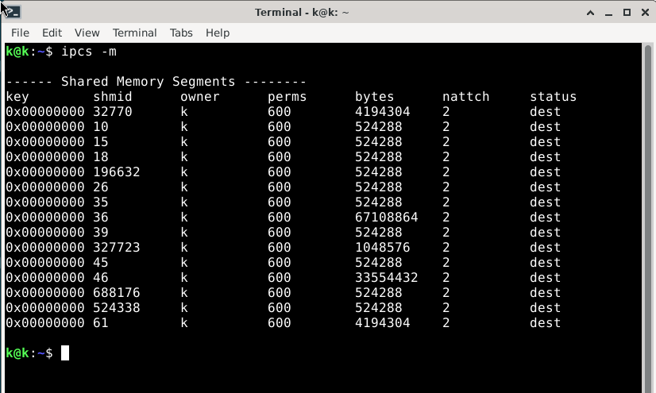      
.    
.     
.       
. ...........................................................................................  
.       
.       
.    
.         
Alright, let’s start:          
```linuxcnc```      
Choose a config…   
      
After starting the program, the Ethernet cable can be connected and the servos powered on.     
      
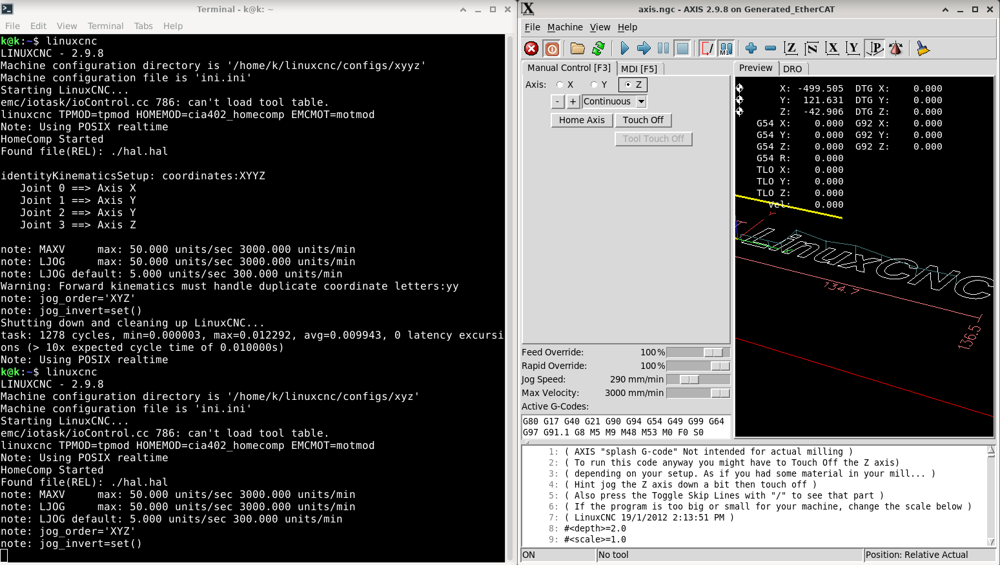       
    
  
----------------------
    
</details>    
  

***


*Note that the parser in the XML generator has been adjusted only for Lichuan ESI.xml files due to the lack of ESI files from other manufacturers. In the future, support for a greater variety will be added.
It is still possible to use the HAL and INI generators with a fixed ethercat-conf.xml.

*Last stege Proposed configuration in ini generator and also 3 homing Cutom joints in hal generator is for absolute encoders with use of softlimits therefore before using automatic configuration, proper installation of the CIA402 homing component is required.      
Then the homing works on the principle of Feedback mirroring – 'pos_fb' reflects 'pos_cmd'.        


