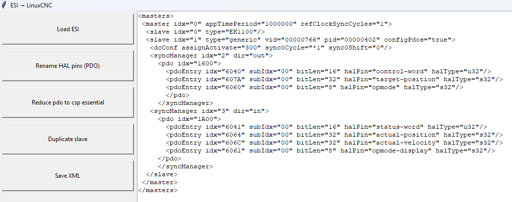
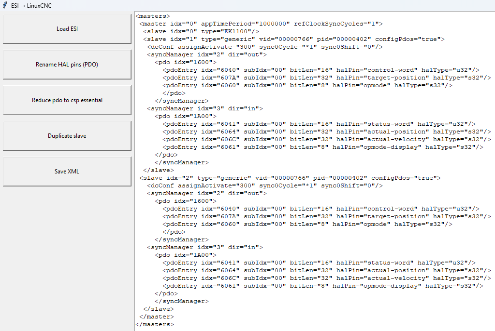
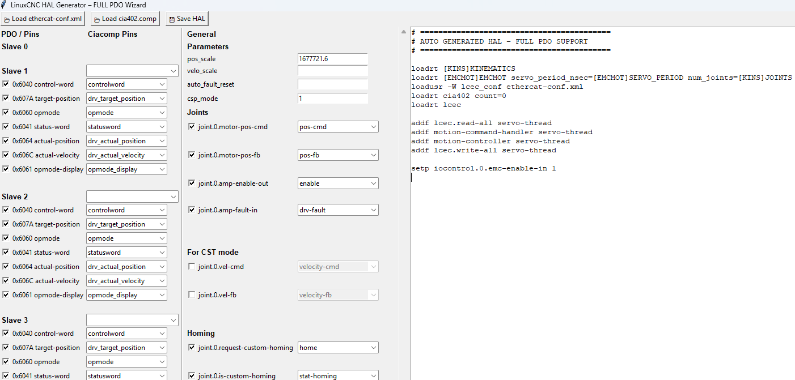
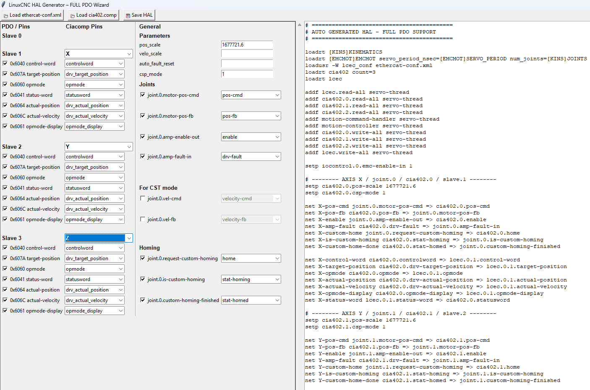
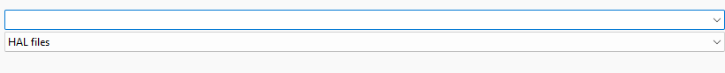
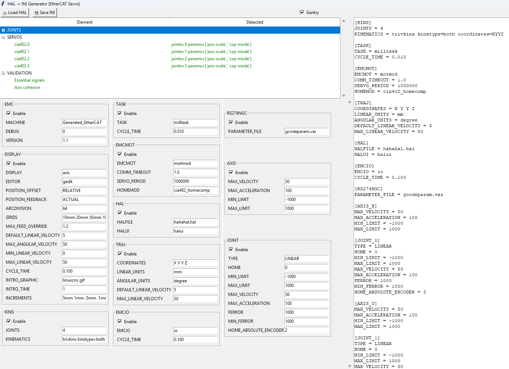
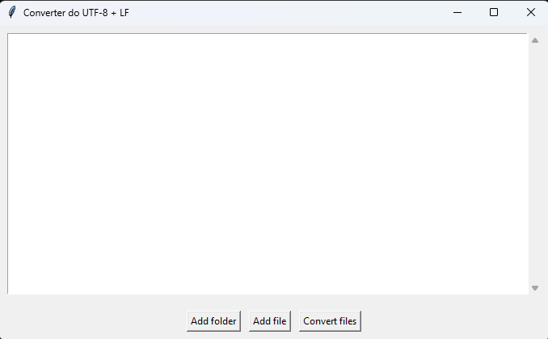

To use the following programs on Windows/Linux, Python 3.14 with tkinter is required.

Note that the parser in the XML generator has been adjusted only for the Lichuan ESI.xml files due to the lack of ESI from other manufacturers. In the future, greater variety will be added.

Last stege Proposed configuration in ini generator and also 3 homing Cutom joints in hal generator is for absolute encoders with use of softlimits therefore before using automatic configuration, proper installation of the [CIA402 homing component](https://github.com/rodw-au/cia402_homecomp) is required.

1. XML Generator

1.1 Load the .xml ESI file from the manufacturer.   

1.2 Replace the names of the HAL pins (PDO).    
It replaces the name modes of operation → opmode and a few others; all pin names can be found in the servodriver manual. 

1.3 Reduce PDOs to CSP essential.   
Keeps the first output group and the first input PDO, keeps essential PDOs for CSP mode; if you want to use CSV mode, target velocity is kept instead of target position. The text can be edited manually. 

1.4 Duplicate the slave.   
Each click duplicates the text </slave... </slave> and increments the slave index in numerical order. 

1.5 Save Xml                              

---

2. HAL Generator

2.1 Load ethercat-conf.xml   
After loading ethercat-conf.xml, all PDOs available in the selected file will appear, and in the HAL generation window on the right side, the configuration initialization section will appear.
LinuxCNC executes the configuration line by line, initializing modules, setting parameters, and preparing the system for motion control.
Among others, in this line: "loadusr -W lcec_conf ethercat-conf.xml", the PDOs from the file with the prefix lcec will be loaded into the HAL module running in LinuxCNC’s internal memory in real time, where all signal connections between devices and the control system are created. 

2.2. load cia402.comp   
The .comp file is parsed into pins and parameters; most of the suggested pins are automatically matched. The pos_scale value should be selected based on the encoder and the stroke per revolution

2.3. Axis selection    
During selection, a specific machine axis (X, Y, Y2, Z, etc.) is assigned to the selected EtherCAT slave, and parameters common to all axes are set. Based on this, the program automatically connects the selected axis to the appropriate control input. 
The HAL file preview is updated in real time, making it easy to understand which value is responsible for what and how the individual settings are related to each other while changing parameters. 

2.4.Save HAL   

---

3. INI Generator

3.1 Load HAL   
The HAL file is treated here as a description of logical connections. In LinuxCNC, an abstract logical model is created that corresponds to how LinuxCNC sees the machine.
Here it is similar, except that the file is only analyzed. The program checks whether the servos share common signals and whether the set of signals is consistent.
The machine moves within a closed space, and homing in this configuration is intended for absolute encoders, which most often use soft limits [MIN_LIMIT] [MAX_LIMIT] often without the use of physical limit switch inputs and I/O modules. For this reason, before using automatic configuration, proper installation of the CIA402 homing component is required.
(linuxcnc-dev, cia402_homecomp.comp, cia402_homecomp.h, basecomp.comp) 

3.2.Gantry mode   
In other words, using two motors in one plane.
After switching to gantry mode, the following arrangement is created: 
1 : 1                                            Gantry
Axis X → joint.0                       Axis X → joint.0
 Axis Y → joint.1                       Axis Y → joint.1 , joint.2
 Axis Z → joint.2                      Axis Z →  joint.3
Axis A → joint.3
And the parameters in [KINS] and [TRAJ] change dynamically and later define the recognition of the mode by LinuxCNC during loading. 

3.3.Save INI   

---

4. DosStyle → UTF-8 LF Converter

4.1 When files are saved in the programs presented above on Windows, DosStyle line endings are created. It is enough to enable the Converter, enter the given folder with the files, or load the files individually, or paste the file path, and press convert. 

